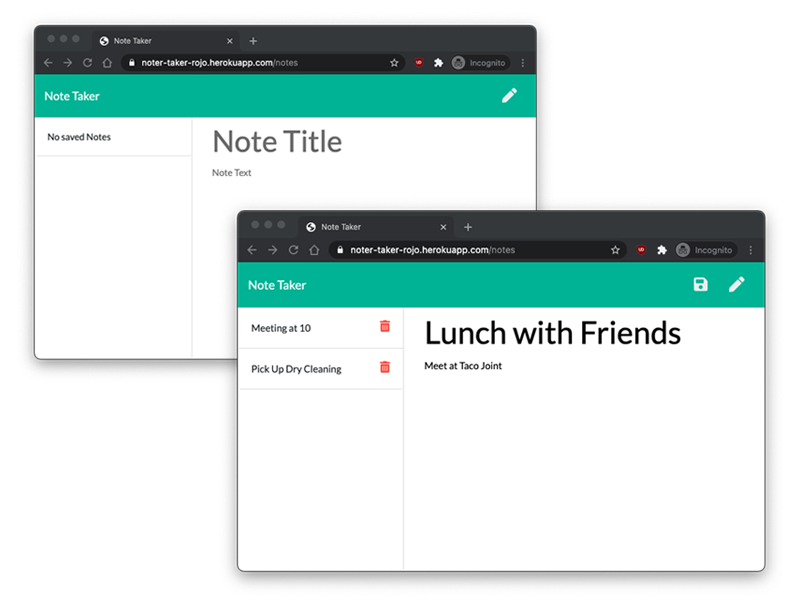

# :rocket: 011-Note-Taker

[Visit the Depoloyed Site](https://noter-taker-rojo.herokuapp.com)

# :zap: Description
A simple web app built with Node.js and Express. The goal of this project was to gain familiarity taking an existing front end, and using Express to create a server and connect the functionality with a database(in this case only .json file). 

## Functionality
- When on the landing page, click / tap `Get Started` to move into the note app.
- If notes have previouly been made, they will be displayed on the left hand column.
- Click on right hand section with the placeholder text `Note Title` and `Note Text` to begin typing a new note. As you type you will see a `Save Icon` appear in the upper left. Once finished with your note, click / tap this icon to save your note to the DB.
- Your saved note will then display on the left hand column.
- Clicking / Tapping an existing note in the left hand column will display the entire note's contents in the right hand side.
- When viewing an existing note, click the `Pencil Icon` in the top right in order to be able to create another new note.

## For Route Creation
- `GET` was used to serve up the html files and any existing notes, 
- `POST` was used to save new notes by pushing the data to the db.json file, and 
- `DELETE` was used to remove any existing notes from the db.json file

## Additional Challenges
As this project was an assignment for a coding bootcamp, the project had a lot of files and code already provided. A few unexpected things however were presented. Serving up public assets such as CSS was not initially explained, and after some research I was able to discover a missing piece of code that was needed:

> app.use(express.static(__dirname + '/public'));

There was also an issue with creating a new note, after viewing existing notes by clicking on them on the left hand side. I found a few lines of code missing from the `renderActiveNote` function provided within the index.js file that remove the read-only attributes from the text items. Adding this code back in helped to finalize part of the fucntionality that was not working with the code that was provided for this assignment.

# :zap: Usage and License
This repo is public and covered under the MIT license.

